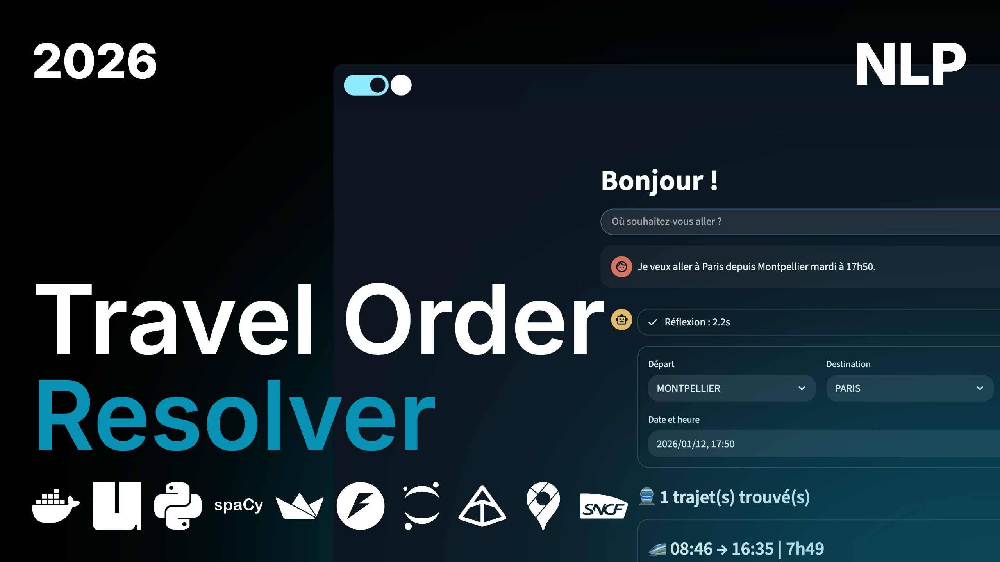

# 🚄 Travel Order Resolver (2026)

<p align="center">
  <br>
  
  
  
  
</p>

🚄 NLP-powered system designed to process natural language trip requests (in French), extract departure and destination points, and generate optimal train itineraries using pathfinding algorithms.

## 📁 Project Structure

```
travel-order-resolver/
├── backend/                 # FastAPI backend
│   ├── app/
│   │   ├── api/v1/          # API routes
│   │   ├── core/            # Configuration & logging
│   │   ├── db/              # Database schemas
│   │   ├── models/          # Pydantic models
│   │   └── services/        # Business logic
│   └── tests/               # Unit tests
├── frontend/                # Streamlit interface
│   ├── app.py               # Entry point
│   └── pages/               # Application pages
├── base/                    # ML/NLP pipeline
│   ├── data/                # Data (raw & processed)
│   ├── models/              # Trained models
│   ├── notebooks/           # Jupyter notebooks
│   │   ├── 01_data_exploration.ipynb
│   │   ├── 02_model_training.ipynb
│   │   └── 03_evaluation.ipynb
│   └── src/                 # ML source code
│       ├── preprocessing.py
│       ├── training.py
│       └── inference.py
└── public/                  # Public resources
    └── docs/                # Project documentation
```

---

## 🚀 Local Development

### Prerequisites

- Python 3.13+
- [uv](https://docs.astral.sh/uv/) (package manager)

### Install Dependencies

```bash
uv sync --locked
```

### Environment Variables

Copy the example file and customize it:

```bash
cp .env.example .env
```

| Variable | Description    | Default |
| -------- | -------------- | ------- |
| `DUMMY`  | Dummy variable | `false` |

### Run Services

| Command              | Description                          |
| -------------------- | ------------------------------------ |
| `uv run poe api`     | Start FastAPI backend (port 8000)    |
| `uv run poe front`   | Start Streamlit frontend (port 8501) |
| `uv run poe jupyter` | Start Jupyter Lab                    |
| `uv run poe dev`     | Start all services in parallel       |

---

## 🐳 Docker

### With Docker Compose (recommended)

```bash
# Build and start all services
docker compose up --build

# Run in background
docker compose up -d --build

# Stop services
docker compose down

# View logs
docker compose logs -f
```

**Available services:**

- Backend API: http://localhost:8000
- Streamlit Frontend: http://localhost:8501
- API Documentation: http://localhost:8000/docs

### Access Container

```bash
docker exec -it travel-resolver-api bash
```

## 📚 Spacy

### Download the French model
`uv run python -m spacy download fr_core_news_md` to download the French model