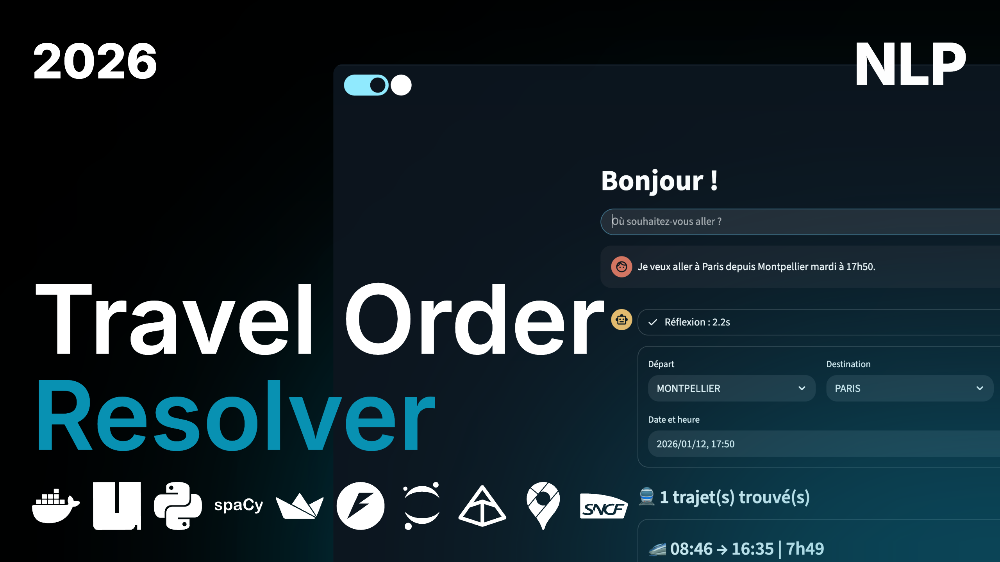

# 🚄 Travel Order Resolver (2026)

<p align="center">
  <br>
  
  
  
  
  
  
  
</p>

NLP-powered system designed to process natural language travel requests (in French), extract departure/destination points and times, then generate optimal train itineraries. The system supports multiple NER backends, multiple pathfinding engines, and a full SNCF GTFS-based graph database.

## 🎬 Demo

[Watch the Travel Order Resolver application in action](https://cdn.lenysauzet.com/Demos/travel-order-resolver.mp4)

---

## ✨ Features

- 🎙️ **Voice Transcription**: Converts audio commands to text via Faster-Whisper
- 🧠 **Multi-Model NER**: Switchable NER backends — custom SpaCy model and fine-tuned CamemBERT
- 🔍 **Fuzzy Matching**: Smart station name matching with TheFuzz
- 📍 **Geolocation**: Automatic detection of the nearest station to the user
- ⏰ **Time Normalization**: Interpretation of French expressions ("demain matin", "15h30", "ce soir")
- 🗺️ **Interactive Maps**: Journey visualization with Folium and Google Maps Directions
- 🚆 **Journey Search**: Integration with Navitia SNCF API
- ⚡ **Dijkstra Pathfinding**: Custom shortest-path algorithm over a GTFS-derived weighted graph
- 🏗️ **Infrastructure Graph**: Alternative graph built from rail line topology and haversine distances
- 🕸️ **Neo4j Graph Engine**: Full GTFS import into Neo4j with GDS Dijkstra and fewest-stops BFS
- 📂 **Batch Processing**: Upload `.txt` or `.csv` files to process multiple travel orders at once
- ⚙️ **Settings Panel**: In-app routing mode toggle, routing engine selector, and NER model selector

---

## 📁 Project Structure

```
travel-order-resolver/
├── backend/                 # FastAPI API
│   ├── app/
│   │   ├── api/v1/
│   │   │   ├── transcription.py         # Audio transcription
│   │   │   ├── travel.py                # NER identification, stations, journeys
│   │   │   ├── travel_routing.py        # Dijkstra routing endpoints
│   │   │   └── neo4j_routing.py         # Neo4j routing endpoints
│   │   ├── core/                        # Configuration & logging
│   │   ├── db/                          # SQLAlchemy schemas
│   │   ├── models/                      # Pydantic models
│   │   └── services/
│   │       ├── transcription_service.py # Faster-Whisper ASR
│   │       ├── travel_service.py        # NER + multi-model dispatch
│   │       ├── routing_service.py       # Dijkstra on weighted CSV graph
│   │       ├── neo4j_service.py         # Neo4j GDS + Cypher routing
│   │       ├── station_matcher.py       # Fuzzy station matching
│   │       ├── time_normalizer.py       # Time normalization
│   │       ├── geolocation.py           # Proximity search
│   │       └── navitia_service.py       # Navitia SNCF API
│   └── tests/                           # Unit tests
├── frontend/                # Streamlit interface
│   ├── app.py               # Entry point (chat + routing)
│   ├── api.py               # Backend API client
│   ├── components/
│   │   ├── batch_upload_modal.py  # Batch file upload UI
│   │   ├── routes_list.py         # Route result cards
│   │   └── settings_modal.py      # Settings panel UI
│   ├── models/              # Frontend Pydantic models
│   └── pages/
│       └── itinerary.py     # Journey detail page + map
├── base/                    # ML/NLP pipeline & graph tooling
│   ├── data/
│   │   ├── raw/             # Raw data (stations, municipalities, audio)
│   │   ├── processed/       # Processed data (entries.csv, dataset)
│   │   ├── Export_OpenData_SNCF_GTFS_NewTripId/  # Full SNCF GTFS dataset
│   │   ├── station_durations.csv       # GTFS-derived weighted graph
│   │   └── station_durations_infra.csv # Infrastructure-derived weighted graph
│   ├── models/
│   │   ├── travel-order-ner-model/     # Trained SpaCy NER model
│   │   └── BERT/
│   │       └── camembert-ner-travel/   # Fine-tuned CamemBERT NER model
│   ├── notebooks/
│   │   ├── 01_data_exploration.ipynb
│   │   ├── 02_model_training.ipynb
│   │   ├── 03_evaluation.ipynb
│   │   └── data_processing/
│   └── src/
│       ├── extract_graph.py          # GTFS → weighted edge CSV
│       ├── build_infra_durations.py  # Rail topology → weighted edge CSV
│       ├── init_neo4j.py             # GTFS bulk import into Neo4j
│       ├── run_pathfinding_test.py   # Pathfinding smoke tests
│       ├── preprocessing.py
│       ├── generate_entries.py
│       └── ner/
│           ├── train_camembert.py    # CamemBERT fine-tuning script
│           ├── test_camembert.py     # CamemBERT inference test
│           ├── custom-models-ner.py
│           ├── pre-trained-ner.py
│           ├── generate-dataset.py
│           └── utils.py
└── public/                  # Public resources
    └── docs/                # Project documentation
```

---

## 🚀 Local Development

### Prerequisites

- Python 3.13+
- [uv](https://docs.astral.sh/uv/) (package manager)
- Neo4j instance (optional, required only for Neo4j routing engine)

### Installation

```bash
# Clone the project
git clone https://github.com/LenySauzet/travel-order-resolver.git
cd travel-order-resolver

# Install dependencies
uv sync --locked
```

### Environment Variables

Create a `.env` file at the project root:

```env
# Navitia API (required for Navitia journey search)
NAVITIA_API_KEY=
NAVITIA_COVERAGE=sncf

# Google Maps (optional, for route drawing)
GOOGLE_MAPS_API_KEY=

# Neo4j (optional, required for Neo4j routing engine)
NEO4J_URI=bolt://localhost:7687
NEO4J_USER=neo4j
NEO4J_PASSWORD=password
```

| Variable              | Description                                             | Required |
| --------------------- | ------------------------------------------------------- | -------- |
| `NAVITIA_API_KEY`     | Navitia SNCF API key ([get a key](https://navitia.io/)) | ✅       |
| `NAVITIA_COVERAGE`    | Navitia SNCF coverage (e.g. `sncf`)                     | ✅       |
| `GOOGLE_MAPS_API_KEY` | Google Maps API key (Directions API)                    | ❌       |
| `NEO4J_URI`           | Neo4j Bolt URI                                          | ❌       |
| `NEO4J_USER`          | Neo4j username                                          | ❌       |
| `NEO4J_PASSWORD`      | Neo4j password                                          | ❌       |

### Download French SpaCy Model

```bash
uv run python -m spacy download fr_core_news_md
```

### Run Services

| Command              | Description                          |
| -------------------- | ------------------------------------ |
| `uv run poe api`     | Start FastAPI backend (port 8000)    |
| `uv run poe front`   | Start Streamlit frontend (port 8501) |
| `uv run poe jupyter` | Start Jupyter Lab                    |
| `uv run poe dev`     | Start all services in parallel       |
| `uv run poe test`    | Run pytest tests                     |

### Service Access

- **Frontend**: http://localhost:8501
- **Backend API**: http://localhost:8000
- **API Documentation**: http://localhost:8000/docs

---

## 🐳 Docker

### With Docker Compose (recommended)

```bash
# Build and start
docker compose up --build

# Run in background
docker compose up -d --build

# Stop services
docker compose down

# View logs
docker compose logs -f
```

### Available Services

| Service            | URL                        | Port |
| ------------------ | -------------------------- | ---- |
| Frontend Streamlit | http://localhost:8501      | 8501 |
| Backend API        | http://localhost:8000      | 8000 |
| API Documentation  | http://localhost:8000/docs | 8000 |

### Access Container

```bash
docker exec -it travel-resolver-api bash
```

---

## 📡 API Endpoints

### Transcription

```http
POST /api/v1/transcribe
Content-Type: multipart/form-data

file: <audio_file>
```

### Travel Request Identification

```http
GET /api/v1/identify-travel-order?text=je+veux+aller+a+Lyon+demain+matin&model=spacy&lat=48.85&lon=2.35
```

| Parameter | Description                                | Default  |
| --------- | ------------------------------------------ | -------- |
| `text`    | Natural language travel request (French)   | required |
| `model`   | NER model key: `spacy` or `camembert`      | `spacy`  |
| `lat`     | User latitude (fallback for departure)     | optional |
| `lon`     | User longitude (fallback for departure)    | optional |

### Available NER Models

```http
GET /api/v1/ner-models
```

Returns the list of NER models available on disk and their display names.

### Station List

```http
GET /api/v1/stations
```

### Journey Search (Navitia)

```http
GET /api/v1/journeys?departure_id=123&destination_id=456&datetime_iso=2024-01-15T14:30:00
```

### Dijkstra Shortest Path

```http
GET /api/v1/shortest-path?start_id=123&end_id=456
```

Returns the optimal path and total duration in minutes computed by the Dijkstra algorithm on the GTFS-derived graph.

### Dijkstra Best Routes

```http
GET /api/v1/best-routes?start_id=123&end_id=456&limit=5
```

Returns up to `limit` best routes with full station-by-station path and coordinates.

### Routing Mode

```http
GET  /api/v1/routing-mode
POST /api/v1/routing-mode?mode=shortcuts
```

Switches between `shortcuts` (GTFS-derived direct travel times) and `no_shortcuts` (infrastructure topology graph). The graph is reloaded in memory on mode change.

### Neo4j — Fastest Path (GDS Dijkstra)

```http
GET /api/v1/neo4j/fastest-path?from_stop=Paris&to_stop=Lyon&depart_after=08:00:00
```

Uses Neo4j Graph Data Science `gds.shortestPath.dijkstra` over the `transport` projection to find the minimum-time path, respecting the departure time constraint.

### Neo4j — Fewest Stops

```http
GET /api/v1/neo4j/fewest-stops?from_stop=Paris&to_stop=Lyon&depart_after=08:00:00
```

Uses Cypher `shortestPath` traversal over `NEXT` and `TRANSFER` relationships to find paths minimizing the number of intermediate stops, returning up to 5 alternatives.

---

## 🧠 NLP Pipeline

### Named Entity Recognition (NER)

The system supports two interchangeable NER backends, selectable at runtime via the settings panel or the `model` query parameter:

| Model Key    | Model                           | Framework        |
| ------------ | ------------------------------- | ---------------- |
| `spacy`      | Custom SpaCy NER                | SpaCy 3.x        |
| `camembert`  | Fine-tuned CamemBERT NER        | HuggingFace / PyTorch |

Both models extract 3 entity types:

| Entity        | Description       | Example                       |
| ------------- | ----------------- | ----------------------------- |
| `DEPARTURE`   | Departure station | "Paris", "Gare de Lyon"       |
| `DESTINATION` | Arrival station   | "Marseille", "Lyon Part-Dieu" |
| `TIME`        | Time expression   | "demain", "15h30", "ce soir"  |

### CamemBERT Fine-Tuning

The `camembert` model is a fine-tuned version of [`Jean-Baptiste/camembert-ner`](https://huggingface.co/Jean-Baptiste/camembert-ner) adapted to the travel order domain:

- **Dataset**: the project's custom `travel-order-dataset.json`, split 80/20 (train/test)
- **Tagging scheme**: BIO (`B-DEPARTURE`, `I-DEPARTURE`, `B-DESTINATION`, `I-DESTINATION`, `B-TIME`, `I-TIME`, `O`)
- **Metric**: seqeval F1 score evaluated at each epoch
- **Early stopping**: patience of 2 epochs; best checkpoint is reloaded automatically
- **Hardware**: automatic `fp16` when a CUDA GPU is detected, CPU fallback otherwise
- **Output**: saved to `base/models/BERT/camembert-ner-travel/`

Training script:

```bash
uv run python base/src/ner/train_camembert.py
```

Inference test:

```bash
uv run python base/src/ner/test_camembert.py
```

### Station Fuzzy Matching

The `StationMatcher` service uses TheFuzz to find the matching station even with typos or name variations (minimum score: 60%).

### Time Normalization

The `TimeNormalizer` interprets:

- French time formats: "15h", "8h30", "à 17h"
- Vague expressions: "matin" (8am), "midi" (12pm), "soir" (6pm)
- Relative expressions via dateparser: "demain", "après-demain", "lundi prochain"

---

## ⚡ Pathfinding Engines

The system provides three independent routing engines, each with distinct trade-offs.

### 1. Dijkstra (CSV Graph)

A pure-Python implementation of Dijkstra's algorithm running over a weighted adjacency graph stored in CSV. The graph is loaded entirely in memory at startup for sub-millisecond query latency.

**Two graph modes** are available and can be toggled at runtime:

| Mode            | Source data                         | Description                                                             |
| --------------- | ----------------------------------- | ----------------------------------------------------------------------- |
| `shortcuts`     | `station_durations.csv`             | Minimum travel times derived directly from SNCF GTFS timetables         |
| `no_shortcuts`  | `station_durations_infra.csv`       | Travel times estimated from rail line topology (PK positions + haversine)|

The active mode is exposed via `GET /api/v1/routing-mode` and can be changed live via `POST /api/v1/routing-mode`.

#### Building the graphs

**GTFS graph** (`shortcuts`): processes `stop_times.txt` from the SNCF GTFS export, computes the minimum travel time between every consecutive pair of stations across all trips, and outputs `station_durations.csv`.

```bash
uv run python base/src/extract_graph.py
```

**Infrastructure graph** (`no_shortcuts`): reads physical rail line data (`liste-des-gares.csv`), orders stations along each line by their track kilometre marker (PK), estimates travel durations from PK distances or haversine distances at 110 km/h average speed, cross-references with GTFS data to use the lower bound, and also generates transfer edges between stations in the same municipality within 4 km.

```bash
uv run python base/src/build_infra_durations.py
```

### 2. Neo4j — Fastest Path (GDS Dijkstra)

The full SNCF GTFS feed is imported into a Neo4j database as a property graph. A GDS in-memory projection named `transport` is created over `StopTime` nodes using `NEXT` (sequential timetable) and `TRANSFER` (inter-trip connections) relationships weighted by travel time in minutes.

The `fastest_path` query uses `gds.shortestPath.dijkstra.stream` to find the minimum-time path from a departure stop to an arrival stop, respecting a `depart_after` time constraint.

```http
GET /api/v1/neo4j/fastest-path?from_stop=Paris&to_stop=Lyon&depart_after=08:00:00
```

Response fields:

| Field              | Description                                      |
| ------------------ | ------------------------------------------------ |
| `duration_minutes` | Total travel time in minutes                     |
| `nb_steps`         | Number of steps in the path                      |
| `stations`         | Ordered list of intermediate station names       |
| `trips`            | List of trip IDs used along the path             |

### 3. Neo4j — Fewest Stops

Uses Cypher's native `shortestPath` pattern over `[:NEXT|TRANSFER*..100]` relationships to minimize the number of intermediate stops (ignoring time cost). Returns up to 5 alternative routes.

```http
GET /api/v1/neo4j/fewest-stops?from_stop=Paris&to_stop=Lyon&depart_after=08:00:00
```

Response fields per route:

| Field              | Description                                      |
| ------------------ | ------------------------------------------------ |
| `nb_steps`         | Total number of steps                            |
| `nb_transfers`     | Number of train changes                          |
| `duration_minutes` | Cumulative travel time in minutes                |
| `stations`         | Ordered list of intermediate station names       |
| `trips`            | List of trip IDs used                            |

### Neo4j Setup

The `init_neo4j.py` script performs a full GTFS import into Neo4j in the following order:

1. Creates uniqueness constraints and indexes
2. Imports `Agency`, `Stop`, `Route`, `Trip`, `StopTime`, `ServiceDate` nodes
3. Creates `PART_OF` (stop hierarchy), `HAS_TRIP`, `AT_STOP`, `NEXT`, and `TRANSFER` relationships
4. Sets a unified `weight` property on `NEXT` and `TRANSFER` relationships (travel time in minutes)
5. Creates the `transport` GDS in-memory projection

```bash
uv run python base/src/init_neo4j.py
```

The Neo4j graph schema:

```
(Agency)-[:OPERATES]->(Route)-[:HAS_TRIP]->(Trip)-[:HAS_STOP_TIME]->(StopTime)
(StopTime)-[:AT_STOP]->(Stop)-[:PART_OF]->(Stop)
(StopTime)-[:NEXT {weight}]->(StopTime)
(StopTime)-[:TRANSFER {weight}]->(StopTime)
```

---

## 📂 Batch Processing

The batch upload feature allows processing multiple natural language travel orders at once. A modal dialog accessible from the chat interface accepts `.txt` or `.csv` files.

**Supported formats:**

- `.txt`: one sentence per line
- `.csv`: one sentence per row; an optional header row (`sentence`, `text`, `phrase`, etc.) is automatically detected and skipped

For each sentence the system:
1. Calls `identify_travel_order` with the currently selected NER model
2. Resolves departure and destination station names
3. Runs `get_best_routes` with the Dijkstra engine
4. Returns a summary table with each sentence and its resolved route or error message

The results are displayed as an interactive dataframe inside the modal and are cached per file + routing mode combination to avoid redundant reprocessing.

---

## ⚙️ Settings Panel

A gear icon in the top-right corner of the frontend opens a settings dialog with three controls:

| Setting          | Options                                              | Description                                          |
| ---------------- | ---------------------------------------------------- | ---------------------------------------------------- |
| Routing mode     | `shortcuts` / `no_shortcuts` (toggle)                | Switches the active Dijkstra graph on the backend    |
| Routing engine   | `Dijkstra (CSV)`, `Neo4j (fastest)`, `Neo4j (fewest)` | Selects which pathfinding engine is used for queries |
| NER model        | `SpaCy NER`, `CamemBERT NER`                         | Selects which model processes the natural language   |

Changes take effect immediately without restarting any service.

---

## 📓 Notebooks

| Notebook                    | Description                               |
| --------------------------- | ----------------------------------------- |
| `01_data_exploration.ipynb` | Station and municipality data exploration |
| `02_model_training.ipynb`   | SpaCy NER model training                  |
| `03_evaluation.ipynb`       | Model performance evaluation              |
| `data_processing/`          | Data preparation notebooks                |

---

## 🧪 Tests

```bash
# Run all tests
uv run poe test

# With coverage
uv run pytest -v --cov=backend
```

---

## 📦 Technologies

| Category     | Technologies                                                                     |
| ------------ | -------------------------------------------------------------------------------- |
| **Backend**  | FastAPI, Uvicorn, SQLAlchemy, Pydantic                                           |
| **Frontend** | Streamlit, Folium, Streamlit-Folium, streamlit-js-eval                           |
| **NLP/ML**   | SpaCy, Faster-Whisper, TheFuzz, dateparser, HuggingFace Transformers, CamemBERT |
| **Pathfinding** | Dijkstra (heapq), Neo4j GDS (`gds.shortestPath.dijkstra`), Cypher `shortestPath` |
| **Graph DB** | Neo4j, Neo4j GDS, APOC                                                           |
| **Data**     | SNCF GTFS Open Data, Pandas, scikit-learn, seqeval                               |
| **APIs**     | Navitia SNCF, Google Maps Directions                                             |
| **Tools**    | uv, Docker, Jupyter, pytest                                                      |

---

## 📄 License

This project is developed for educational purposes.
